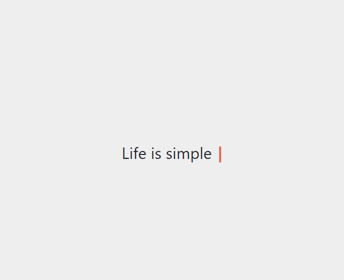

# React Use Typewriter

> A configurable react hook for a typewriter effect. Includes a Typewriter component out the box. Forked from `react-simple-typewriter`

[](https://www.npmjs.com/package/@chrisfieldsii/react-use-typewriter) [](https://standardjs.com)

<p align="center">
  
</p>

## Install

```bash
# npm
npm i @chrisfieldsii/react-use-typewriter

# Yarn
yarn add @chrisfieldsii/react-use-typewriter
```

## Usage (Hook)

```jsx
import { useTypewriter } from '@chrisfieldsii/react-use-typewriter'

const CustomSimpleTypewriter = () => {
  const text = useTypewriter({
    words: ['i', 'use', 'hooks!'],
    loop: true,
    onLoop: (loopCount) => console.log(`Hook completed loop ${loopCount}`),
    onDone: () => console.log('Done!')
  })

  return <span>{text}</span>
}
```

### Hook Configuration (see props table below for descriptions)

```typescript
interface TypewriterConfig {
  words: string[]
  loop?: boolean = false
  typeSpeed?: number = 100
  deleteSpeed?: number = 50
  delaySpeed?: number = 1500
  onLoop?: (loopCount: number) => void = noop // only called if loop = true
  onDone?: () => void = noop // only called if loop = false
}
```

## Usage (Component)

```jsx
import React from 'react'

import { Typewriter } from '@chrisfieldsii/react-use-typewriter'
import '@chrisfieldsii/react-use-typewriter/dist/index.css'

export default function App() {
  return (
    <div className='App'>
      <h1
        style={{ paddingTop: '5rem', margin: 'auto 0', fontWeight: 'normal' }}
      >
        Life is simple{' '}
        <span style={{ color: 'red', fontWeight: 'bold' }}>
          {/* Style will be inherited from the parent element */}
          <Typewriter
            loop
            cursor
            cursorStyle='_'
            typeSpeed={70}
            deleteSpeed={50}
            delaySpeed={1000}
            words={['Eat', 'Sleep', 'Code', 'Repeat!']}
            onLoop={(loopCount) =>
              console.log(`Just completed loop ${loopCount}`)
            }
          />
        </span>
      </h1>
    </div>
  )
}
```

### Available Props

| Prop          | Type                         | Description                                                                                                    | Default  |
| ------------- | ---------------------------- | -------------------------------------------------------------------------------------------------------------- | :------: |
| `loop`        | Boolean                      | Repeat the typing effect (true if present)                                                                     | `false`  |
| `cursor`      | Boolean                      | Show / Hide cursor (show if present)                                                                           | `false`  |
| `cursorStyle` | String                       | Change the cursor style                                                                                        |  &#124;  |
| `typeSpeed`   | Integer                      | Speed in Milliseconds                                                                                          |  `100`   |
| `deleteSpeed` | Integer                      | Word deleting speed in Milliseconds                                                                            |   `50`   |
| `delaySpeed`  | Integer                      | Delay after the word is written in Milliseconds                                                                |  `1500`  |
| `words`       | Array                        | Array of strings holding the words                                                                             | required |
| `onLoop`      | (loopCount: Integer) => void | Called when a loop is complete. `loopCount` is the total number of completed loops. Only called if loop = true |  `noop`  |
| `onDone`      | () => void                   | Called when typewriter is done. Only called if loop = false                                                    |  `noop`  |

<!-- ### [Demo](https://react-simple-typewriter.vercel.app/) -->

<!-- ### [codeSandbox](https://codesandbox.io/s/react-typewriting-effect-8ulgs) -->

### License

MIT © [ChrisLFieldsII](https://github.com/ChrisLFieldsII)
